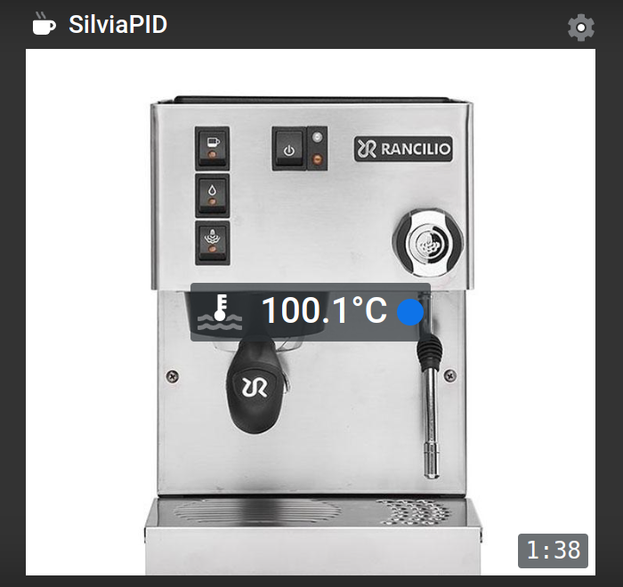

# SilviaPID

An ESP8266 / Arduino based "PID" controller for your coffee machine controlled via a web interface. 




## Overview

This project"SilviaPID" is heavily based on the cool project [CoffePID](https://github.com/1024kilobyte/CoffeePID)
from user [1024kilobyte](https://github.com/1024kilobyte). He described his project very detailed in his blog:

- [project idea and hardware choice](https://1024kilobyte.com/blog/2020/3/3/new-project-coffeepid-a-generic-pid-controller-for-coffee-machines)
- [writing the arduino code](https://1024kilobyte.com/blog/2020/3/3/coffeepid-the-software)
- [creating the web interface](https://1024kilobyte.com/blog/2020/8/2/coffeepid-the-web-interface)
- [putting everything together](https://1024kilobyte.com/blog/2020/7/22/coffeepid-the-build)
- [coffeepid optimizations](https://1024kilobyte.com/blog/2020/8/3/coffeepid-optimizations)


# Setup for Rancilio Silvia

I changed his HW settings slightly to adapt it to my Rancilio Silvia. The HW consists of 4 main components:
- a ESP8266 NodeMCU microcontroller board
- a 10 k NTC sensor (0..200°C) at analog input A0
- a SSR relay (pin variable "relayPin" in code)
- a 5 V power supply

## Wiring for Rancilio Silvia

To integrate CoffeePID into the electric of the Silvia you only need to get 230V for the power supply,
wire the SSR in parallel to the thermostat and screw the NTC to the boiler.
My wiring uses 6.3 mm double-blade connectors and can be undone easily. 
If you power the machine on it will heat up as usual with 100% power until the original thermostat opens at about 100°C,
then the PID will take over as long as the temperature stays over the switch-on point (about 85°C) of the thermostat.
With this setup your machine will work also when the ESP is not connected or not working. 

# Setup / Install

As the project is based on the Arduino environment, you need to install some prerequisites to use this project. Those are:

- Arduino IDE
- ESP8266-extension to the Arduino IDE
- LittleFS-extension to the Arduino IDE
- OTA-extension

You should then be able to checkout this project and open the "SilviaPID.ino"-file in your Arduino IDE. 
To connect directly to your WLan you have to prepare the file `data/config.json`, just copy it from `data/config_template.json` and enter your `SSID` and `PASSWORD` and change the preferred_wifi_mode to `"client"`.
`data/config.json` shold look like my example below:

```json
{
    "preferred_wifi_mode": "ap",
    "wifi_client_ssid": "MY_SSID",
    "wifi_client_password": "MY_SUPER_SECRET_WIFI_PASSWORD",
    "wifi_ap_ssid": "SilviaPID",
    "wifi_ap_password": "Rancilio",
    "target_temp": 100.0,
    "pid_kp": 25.0,
    "pid_ki": 1.0,
    "pid_kd": 100.0
}
```

If a compatible ESP8266-board is connected via USB, you should be able to transfer the data-folder
to the LittleFS area (Tools-menu: ESP8266 LittleFS Data Upload). And finally you just have to transfer
the sketch to the ESP via the upload button in the Arduino IDE. SilviaPID should directly connect to your wifi.
Otherwise on first startup the SilviaPID is starting its own wifi access point called "SilviaPID",
the password is "Rancilio", you may take a look at the serial monitor to check for any issues.
After connecting to this network the ESP can be reached via the url http://silviapid (or http://silviapid.local
on some setups). You can change the wifi settings in the settings tab of the website and enter your
wifi SSID and password. After uploading the sketch to the ESP you can select in Arduino tools menu either
Serial port (`dev/ttyUSB0` on my linux machine) or Network port (`silviapid at nnn.nnn.nnn.nnn`)
and do the next uploads OTA (over the air).

# Development

As the webserver is optimized to only deliver `*.gz`-compressed files you have to unzip a file to edit it
and re-compress any file after you changed it. To make this more convenient I added shell-scripts to the
root of the project called `optimize.sh`. It should work without any changes on Mac and Linux systems,
as long as you have the used tools installed, like purgecss and uglifycss. Before executing the script
you need to unpack the `app.html.gz` to `app.html` inside the `www`-folder.
To simply change the html files just use `html_unzip.sh` and `html_zip.sh`.

## PID setup
The PID control takes the current temperature, compares it with the setpoint and provides an output to switch
the heater on or off to reach the setpoint fast and keep the temperature stable. This is done by looking at:
- the difference between current temperature and setpoint (the proportional part P, zero if at setpoint)
- how fast does the current temperature rise or fall (the differential part D, zero if temperature does not change)
- how long and how far are we away from setpoint (the integral part I)

If the temperature is stable at the setpoint the machine needs still a typical amount of heating (`pidBalance`)
to compensate the cooling losses and keep the temperature stable. This amount is provided only by the integral part.
The value of `pidBalance` depends on the typ of boiler/heater and other parameters, e.g. thermal insulation and can be
detected by looking at `pidOutput` at balance point.

### PID Optimization
I added some special treatment for this integral component to reduce overshoot without losing speed.
- `heaterPID.setBangBang( 5, 1 )` resets the PID 5K below setpoint (output=100%) and 1K above setpoint (output=0%).
- inside this temperature range (-5K ... +1K) the integral part is limited to 150% of the `pidBalance` value.
- if entering the narrow band around the setpoint (-0.5K ... + 0.5K) the integral part is set to `pidBalance`.

## PID Tuning

You have the possibility to watch the temperature with the Arduino serial plotter, just open it as soon as the heating starts.
The key 'E' enables the parameter display/edit, 'e' disables it. The top line of the plotter window displays a short info
about the P,I,D parameters as well as B (balance). You can change them in realtime with the keys 'p', 'P' (decrease/increase P parameter),
'i', 'I' (same for I), 'd', 'D' (same for D) and 'b', 'B' (same for Balance).
'@' updates the file `config.json` with the current PID parameters.

The URL http://silviapid/get_status provides the heating and PID status, format:
````
targetTemp currentTemp isHeating millis isStandby pidError∙pidKP integral∙pidKI pidDError∙pidKD pidBalance pidOutput
````

